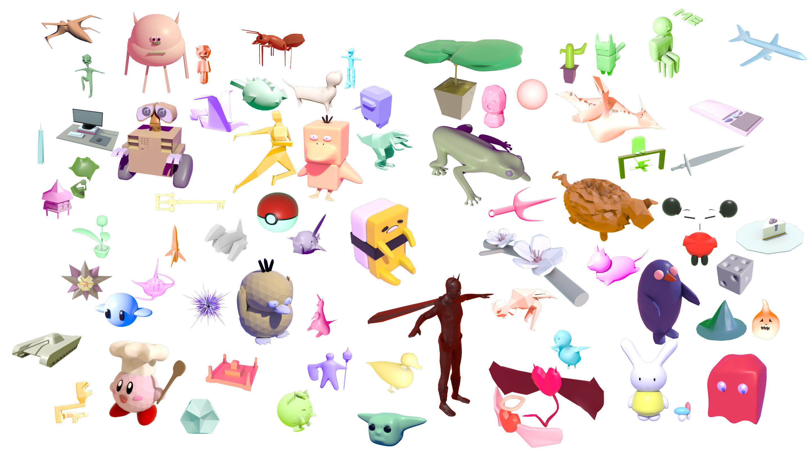

# Scotty3Dataset

The meshes in this dataset were created by students in the intro computer graphics course at Carnegie Mellon University (15-462/662).  More information about this course can be found at <http://15462.courses.cs.cmu.edu/fall2020>

Each mesh was created by a different student, using their own implementation of a polygonal mesh editor / subdivision modeler, within the pedagogical software framework [Scotty3D](https://github.com/CMU-Graphics/Scotty3D).  Models are not guaranteed to be closed, manifold, or free of self-intersections; many models have inconsistent orientation across different components.  We are hopeful that this data will be useful to algorithm and application developers interested in serving novice/non-professional users.  In addition to surface geometry, many of these models include material attributes and named parts.  Some models may contain additional scene data (e.g., lights or cameras).

Models are organized into subdirectories by semester---e.g., `fa2020` models come from the fall 2020 course offering.  Please check back for additional models added in future semesters.

# Formats and processing

All models are provided as the original COLLADA (.dae) files, as generated by each student's modeling software and output via the [Open-Asset-Importer-Lib](https://www.assimp.org/).  No subsequent processing has been performed, except to do a textual search-and-replace to remove shading attributes that made the models difficult to view in common 3D packages (e.g., default transparency and emissivity values of 100%, which rendered all models as invisible or bright white).  The script used to perform processing can be found in `meta/Clean.pl`.

# License

Models are made available under CreativeCommons licenses by their respective copyright owners; see individual license files for details.  Unless otherwise noted, all licenses are CreativeCommons CC BY 4.0 (see https://creativecommons.org/licenses/by/4.0/ for more details).

[Note for maintainers: the script used to generate license files from student roster files can be found in `meta/makeLicenses.pl`; it should work directly with CSV files obtained from S3.]

# Notes

The mosaic above was generated using Qingnan Zhou's [Mosaic Generator](https://github.com/qnzhou/Mosaic).  Images are copyright of their respective copyright holders.

